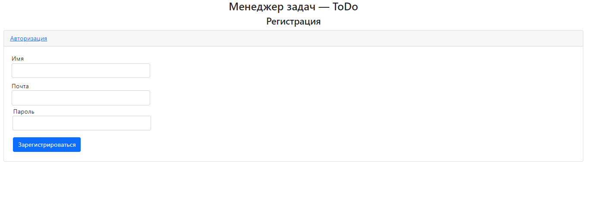

Сервис - Кинотеатр

Использоване при разработке технологии:

◉ Java Servlet
◉ PostgreSQL
◉ JDBC
◉ Apache Tomcat
◉ JSP/JSTL
◉ Log4j
◉ Maven

На главной странице пользователя встречает таблица, в которой отображены свободные и занятые места.

После того, как пользователь выбирет места, на которые он хочет купить билеты, ему будет предложено ввести свои данные.

В случае, если пока он вводил свои данные никто не купил билеты на его места, сервис поздравит его с покупкой.

Если кто-то опередил пользователя, то ему будет предложено купить билеты на другие места.

