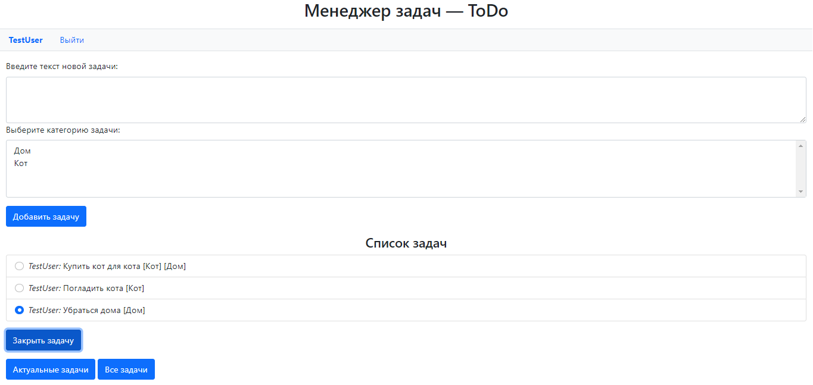

Менеджер задач — ToDo

Использоване при разработке технологии:

◉ Java Servlet
◉ Hibernate
◉ PostgreSQL
◉ JDBC
◉ Apache Tomcat
◉ JSP/JSTL
◉ Maven

На главной странице пользователя встречает приветственная страница, на которой ему предлагается зарегистрироваться или войти под своей учетной записью.

Регистрация:

Авторизация:

После авторизации пользователь попадает в менеджер задач. Задачам можно присваивать категории, которые затем будут отображаться в списке.

По мере выполнения задач пользователь может отмечать их выполненными.

Пользователь может выбирать какие задачи он хочет видеть.

Либо актуальные:

Либо все:

_____________

Никита Игнатов

