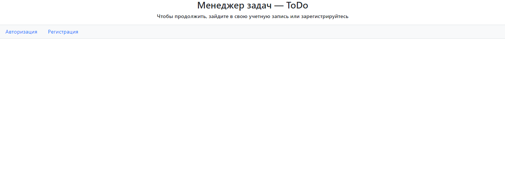

Менеджер задач — ToDo

Использоване при разработке технологии:

◉ Java Servlet
◉ Hibernate
◉ PostgreSQL
◉ JDBC
◉ Apache Tomcat
◉ JSP/JSTL
◉ Maven

На главной странице пользователя встречает актуальный список задач.

Пользователь может добавить новые задачи. 

По мере выполнения задач пользователь может отмечать их выполненными.

Пользователь может выбирать какие задачи он хочет видеть.
Либо актуальные:

Либо все:

